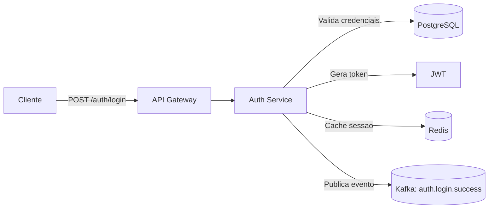
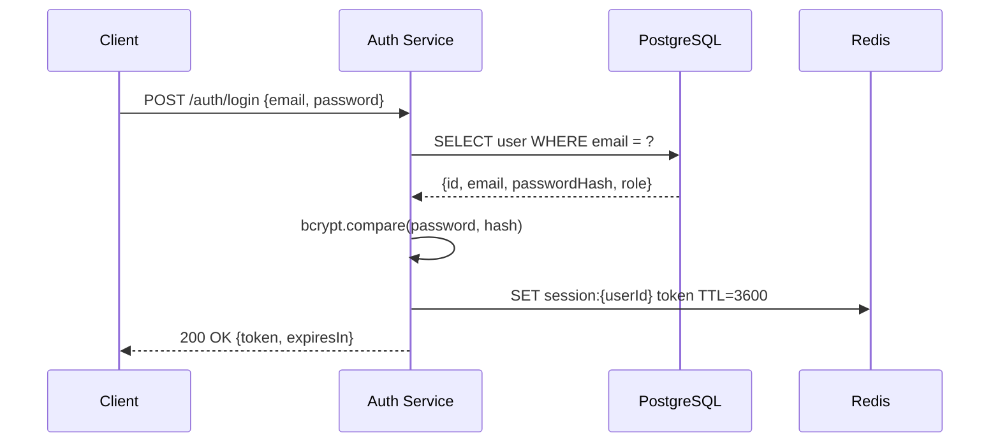

## Entradas esperadas
- Acesso ao codigo-fonte (read/grep/glob/bash)
- Objetivo: `bootstrapping` (documentacao completa do zero) ou `fluxo especifico` (documentar um fluxo ja existente)
- Contexto opcional: nome do fluxo, servicos envolvidos, endpoints conhecidos

## Processo

### Etapa 1 — Analise do projeto

Antes de escrever qualquer documentacao, leia o codigo. Execute em paralelo:
```bash
# Contar arquivos de codigo
find . -type f \( -name "*.ts" -o -name "*.js" -o -name "*.py" -o -name "*.go" \) | wc -l
# Estrutura de diretorios
ls -la
# Identificar frameworks e dependencias
cat package.json 2>/dev/null || cat requirements.txt 2>/dev/null || cat go.mod 2>/dev/null
```

Baseado na analise, calcule a estimativa de tempo:
```
Pequeno  (< 20 arquivos)  → 3-5 min  | 1-3 fluxos esperados
Medio    (20-100 arquivos) → 8-15 min | 4-8 fluxos
Grande   (> 100 arquivos)  → 20-40 min | 9-20 fluxos
Muito Grande (> 500)       → 40-90 min | 20+ fluxos
```

### Etapa 2 — Comunicar e decidir modo de execucao

Se `.project-docs/context/initial-context.md` nao existe, comunique ao usuario antes de prosseguir:

```
⚠️ DOCUMENTACAO AUSENTE DETECTADA

Analise do projeto:
- Arquivos de codigo: {N} arquivos
- Estrutura: {Simples|Moderada|Complexa}
- Fluxos estimados: {N} fluxos principais
⏱️ TEMPO ESTIMADO: {X-Y} minutos

🔀 OPCOES:

A) PARALELO (Recomendado para tarefa simples):
   - Executo documentacao EM PARALELO com sua tarefa
   - ⚠️ So funciona se a tarefa for simples e independente

B) SEQUENCIAL (Recomendado para tarefa complexa):
   - Executo documentacao ANTES da tarefa
   - Garante contexto completo para trabalho posterior

C) PULAR (Nao recomendado):
   - ⚠️ RISCO: decisoes baseadas em suposicoes

Como prefere que eu proceda?
```

**Regra de decisao automatica (quando usuario nao especifica):**
- Projeto pequeno + tarefa simples → sugerir PARALELO
- Projeto medio/grande OU tarefa complexa → sugerir SEQUENCIAL obrigatorio

### Etapa 3 — Configurar estrutura de arquivos

```bash
# Criar estrutura
mkdir -p .project-docs/context .project-docs/docs/flows validar

# Adicionar validar/ ao .gitignore (nao commitar checklists temporarios)
grep -q "^validar/" .gitignore 2>/dev/null || echo "validar/" >> .gitignore
```

### Etapa 4 — Documentar cada fluxo

**CRITICO: leia o codigo antes de documentar cada fluxo.** Nunca escreva sobre um endpoint, payload ou comportamento que voce nao verificou nos arquivos-fonte. Marque incertezas com `[?]`.

Para cada fluxo identificado, crie `.project-docs/docs/flows/<nome-do-fluxo>.md` com as 7 secoes abaixo:

---

#### Secao 1 — Titulo
Titulo claro e objetivo. Ex: `# Fluxo de Autenticacao com JWT`

#### Secao 2 — Descricao geral
- **O que** o fluxo faz
- **Por que** existe (objetivo de negocio e/ou tecnico)
- **Quando** e disparado (HTTP, fila, cron, evento)
- **Quem** consome o resultado (outros servicos, clientes, relatorios)

#### Secao 3 — Payload de entrada
Para cada payload, documentar:
1. Nome/contexto (ex: "Payload da API `POST /auth/login`")
2. Formato (JSON, Avro, CSV...) e estrutura com campos obrigatorios/opcionais
3. Exemplo completo em bloco de codigo
4. Origem dos dados (cliente → endpoint, fila → topico, job → bucket S3)

```json
{
  "email": "usuario@empresa.com",
  "password": "senha123"
}
```

#### Secao 4 — Payload de saida
Mesmo padrao da secao 3: nome/contexto, formato, exemplo e destino dos dados.

```json
{
  "token": "eyJhbGciOiJIUzI1NiIsInR5cCI6IkpXVCJ9...",
  "expiresIn": 3600
}
```

#### Secao 5 — Mapa de integracoes
Tabela resumindo todas as integracoes do fluxo:

| Tipo   | Sistema/Componente | Protocolo/Meio | Descricao                          |
|--------|--------------------|----------------|-------------------------------------|
| Entrada | Cliente Web/Mobile | HTTP REST      | POST /api/v1/auth/login             |
| Saida  | Redis              | SET key/TTL    | Cache de sessao com TTL de 1h       |
| Saida  | Kafka              | Topico `auth.login.success` | Evento para auditoria |

#### Secao 6 — Diagramas Mermaid
Incluir pelo menos 2 diagramas:

**Arquitetura geral:**


**Ciclo de vida (sequenceDiagram):**


#### Secao 7 — Observacoes e particularidades
Incluir aspectos operacionais relevantes:
- Regras de negocio especificas
- Idempotencia (como trata requisicoes duplicadas)
- Estrategias de retry, DLQ, timeouts
- Dependencias criticas entre servicos
- Feature flags e variaveis de ambiente relevantes
- Consideracoes de seguranca e compliance (campos sensiveis, tokenizacao, LGPD)

---

### Etapa 5 — Criar .project-docs/context/initial-context.md

Apos documentar todos os fluxos, crie o arquivo de contexto persistente:

```markdown
# Contexto Inicial do Projeto

> Gerado automaticamente pelo agente @documentation em {data}.
> Leia este arquivo antes de qualquer tarefa para entender o projeto.

## Estrutura do Projeto
[Mapeamento completo de pastas e arquivos principais com propósito de cada pasta]

## Fluxos Principais Mapeados
- [Fluxo 1] - .project-docs/docs/flows/fluxo-1.md
- [Fluxo N] - .project-docs/docs/flows/fluxo-n.md

## Tecnologias Utilizadas
| Tech | Versao | Proposito |
|------|--------|-----------|
| ... | ... | ... |

## Padroes Arquiteturais Observados
- [Padrao]: [Onde e usado]

## Pontos de Atencao para Desenvolvimento
- [Dependencias criticas, variáveis de ambiente, comportamentos nao obvios]

## Convencoes de Codigo
- Nomenclatura: [camelCase/snake_case/etc]
- Indentacao: [2/4 espacos/tabs]
- Padroes especificos observados

## Documentacao Detalhada
Ver `.project-docs/docs/` para documentacao completa dos fluxos.
```

### Etapa 6 — Criar .project-docs/docs/README.md e .project-docs/docs/architecture.md

**.project-docs/docs/README.md**: Visao geral da solucao, lista de fluxos com links, glossario de termos recorrentes.

**.project-docs/docs/architecture.md**: Diagrama de arquitetura geral do sistema (todos os servicos, bancos, filas), decisoes arquiteturais e trade-offs observados no codigo.

### Etapa 7 — Commitar

```bash
# Adicionar .gitignore se modificado
git add .gitignore
git commit -m "chore: adiciona validar/ ao gitignore"

# Commitar documentacao
git add .project-docs/
git commit -m "docs: cria estrutura de documentacao e contexto inicial"
```

## Restricoes
- NUNCA inventar payloads, endpoints ou fluxos sem ter lido o codigo-fonte — documentacao inventada e pior que ausencia de documentacao; o time pode tomar decisoes erradas baseadas nela.
- NUNCA assumir comportamentos sem verificar: leia schemas, tipos e interfaces reais antes de documentar.
- Nao documentar parcialmente — todos os fluxos identificados devem ser cobertos de uma vez; documentacao incompleta cria falsa sensacao de completude.
- Nao quebrar em multiplos prompts — a documentacao deve ser entregue completa; cada interrupcao exige re-contextualizacao desnecessaria.
- Marcar incertezas com `[?]` e perguntar ao usuario quando houver ambiguidade critica — e melhor ter uma lacuna sinalizada do que uma suposicao escondida.

## Formato de saida

```
.project-docs/
├── docs/
│   ├── README.md                    # Visao geral e index de fluxos
│   ├── architecture.md              # Diagrama geral do sistema
│   └── flows/
│       ├── fluxo-1.md               # 7 secoes obrigatorias
│       └── fluxo-n.md
└── context/
    └── initial-context.md           # Memoria persistente do projeto

validar/                             # Local apenas, nao commitado
└── checklist.md
```

## Exemplo

**Cenario**: projeto com 45 arquivos TypeScript, NestJS, documentar fluxo de autenticacao

**Output `.project-docs/docs/flows/autenticacao.md`** (resumido):

```markdown
# Fluxo de Autenticacao com JWT

## Descricao geral
Autentica usuarios via email/senha, emite JWT com TTL de 1h e registra evento de login para auditoria.

## Payload de entrada
### Formato
JSON via POST /api/v1/auth/login

```json
{
  "email": "usuario@empresa.com",   // obrigatorio
  "password": "senha123"            // obrigatorio, min 8 chars
}
```
### Origem: Cliente Web/Mobile → API Gateway → Auth Service

## Payload de saida
```json
{
  "token": "eyJhbGciOiJIUzI1NiIs...",
  "expiresIn": 3600
}
```
### Destino: Retorna ao cliente + evento publicado em Kafka

## Mapa de integracoes
| Tipo   | Sistema    | Protocolo | Descricao                    |
|--------|------------|-----------|------------------------------|
| Entrada | Cliente   | HTTP REST | POST /api/v1/auth/login      |
| Saida  | PostgreSQL | TypeORM   | SELECT usuario por email     |
| Saida  | Redis      | SET/TTL   | Cache de sessao por 1h       |
| Saida  | Kafka      | Producer  | auth.login.success           |

## Diagramas
[flowchart + sequenceDiagram conforme formato acima]

## Observacoes
- Senhas comparadas com bcrypt (10 rounds) — nunca armazenadas em texto
- Token invalido apos logout (blacklist no Redis)
- 5 tentativas erradas bloqueiam conta por 15 min
```

## Checklist de completude
Antes de considerar documentacao completa:

- [ ] Pasta `.project-docs/docs/` criada?
- [ ] Pasta `.project-docs/docs/flows/` criada?
- [ ] TODOS os fluxos identificados estao documentados?
- [ ] Cada fluxo tem payload de entrada com exemplo?
- [ ] Cada fluxo tem payload de saida com exemplo?
- [ ] Cada fluxo tem mapa de integracoes (tabela)?
- [ ] Cada fluxo tem pelo menos 2 diagramas Mermaid?
- [ ] `.project-docs/docs/README.md` criado com visao geral?
- [ ] `.project-docs/docs/architecture.md` criado?
- [ ] `.project-docs/context/initial-context.md` criado e completo?
- [ ] `validar/` adicionado ao `.gitignore`?

## Anti-padroes

❌ **Documentacao parcial**
> "Documentei os 3 principais fluxos. Os outros nao sao tao importantes."
✅ CORRETO: Documentar TODOS os fluxos identificados, incluindo secundarios.

❌ **Quebrar em multiplos prompts**
> "Vou documentar 2 fluxos agora e voce me pede o resto depois."
✅ CORRETO: Documentar todos os fluxos de uma vez.

❌ **Documentar sem ler o codigo**
> Endpoint POST /api/users com Body: { "name": string, "email": string, "age": number }
✅ CORRETO: [Lido de src/routes/users.ts:45] Body: { "name": string, "email": string, "role": "admin" | "user" }

❌ **Documentacao sem diagramas**
> Apenas descricao textual do fluxo.
✅ CORRETO: flowchart de arquitetura + sequenceDiagram do ciclo de vida.
